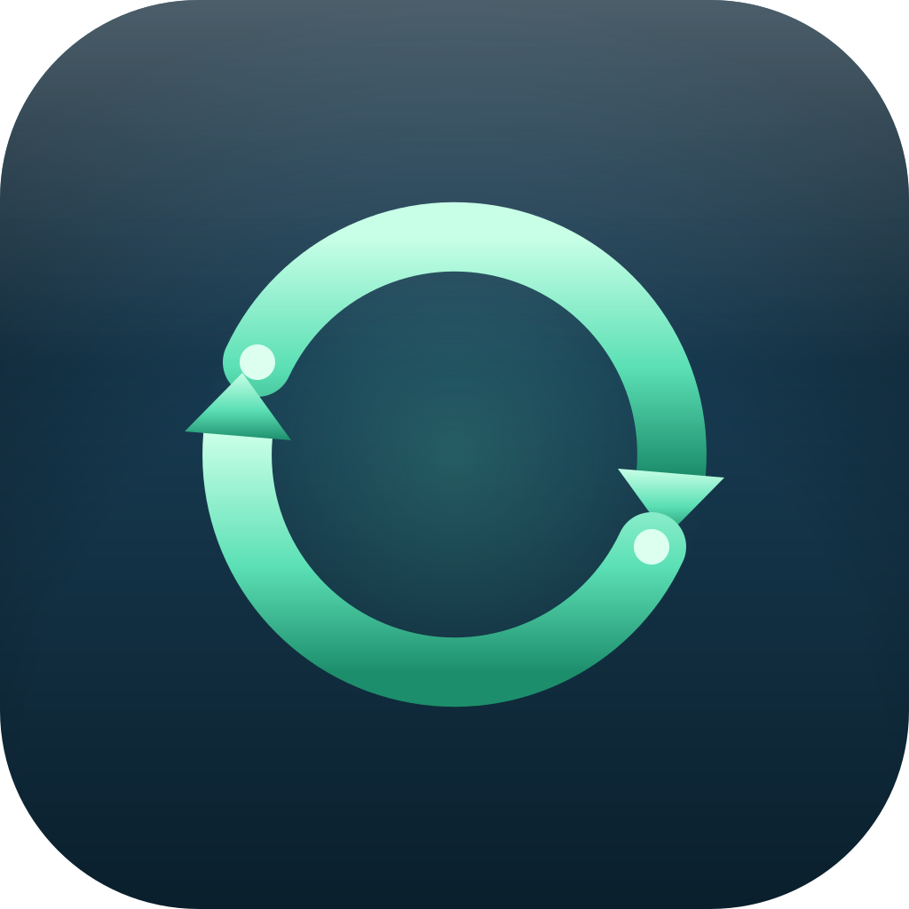

<p align="center">
  
</p>

# git-auto-sync

Automatically commits, rebases, and pushes your git repos in the background. You edit files, it keeps them synced. Comes with an optional macOS menu bar app.

Fork of [GitJournal/git-auto-sync](https://github.com/GitJournal/git-auto-sync) — fixed for modern macOS, uses `gh` + HTTPS, handles git locks gracefully.

## Install

Requires `just` and `go`. On macOS, also needs Xcode command line tools for the menu bar app.

```
just install-all
```

Or just the daemon: `just install`
Or just the menu bar app: `just install-app`

## Usage

### Quick test

```
git-auto-sync sync
```

Commits any changes, fetches, rebases, and pushes. If there's nothing to commit, it just syncs.

### Add a repo to the daemon

```
git-auto-sync daemon add ~/my-repo
```

That's it. The daemon starts automatically and watches the repo for file changes. It also polls every 10 minutes and syncs on wake from sleep.

### Other commands

```
git-auto-sync daemon status    # is the daemon running?
git-auto-sync daemon ls        # which repos are being watched?
git-auto-sync daemon add .     # add current directory
git-auto-sync daemon rm ~/repo # stop watching a repo
git-auto-sync daemon restart   # restart after an update
```

## macOS menu bar app

Shows sync status for each repo, recent activity log, and native notifications on errors. Install with `just install-app`, or run directly with `just run-app`.

The app connects to the daemon over a Unix socket. The daemon works fine without it.

## How it works

- Watches the filesystem for changes (via `fsnotify`)
- On change: stages all, commits with a summary message, fetches, rebases, pushes
- On conflict: aborts the rebase and notifies you
- Retries with backoff on transient errors (lock contention, network issues)
- 5-second cooldown after each sync to avoid re-triggering from its own git operations
